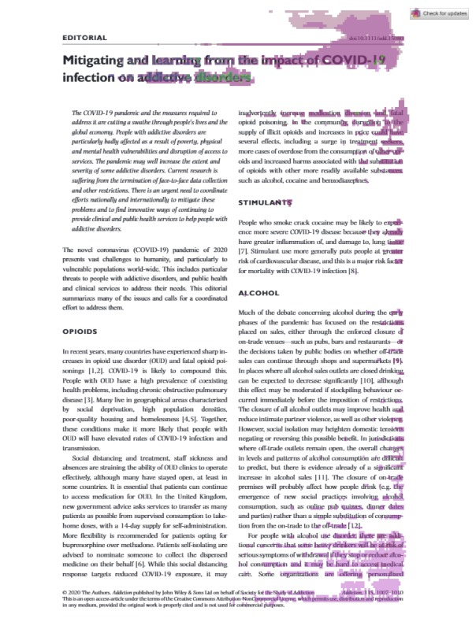

# 📄 DocSAM Work – Experimentos em Segmentação de Documentos Científicos

Este repositório reúne notebooks, scripts e experimentos realizados com o modelo **DocSAM (Document Segment Anything Model)**, aplicados ao contexto de segmentação de documentos científicos — especialmente artigos biomédicos relacionados à COVID-19.

O objetivo é avaliar o comportamento do DocSAM em ambiente acadêmico, utilizando hardware limitado, bem como testar seu desempenho em documentos complexos e com múltiplos layouts.

---

## 🖼️ Demonstração

### Exemplo de segmentação gerada pelo modelo:


### Imagem original:


> ⚠️ Devido à indisponibilidade do módulo semântico (Sentence-BERT), os resultados mostrados são apenas ilustrativos e não representam o desempenho pleno do DocSAM.

---

## 🚧 Status do Projeto
**Em desenvolvimento.**

---

## ✨ Principais Funcionalidades
- Execução de inferência utilizando o modelo **docsam_large_doclaynet**.
- Pipeline simplificado de segmentação de documentos.
- Processamento de PDFs convertidos para imagens.
- Visualização de resultados segmentados.
- Compatível com Jupyter Lab e ambientes Conda.

---

## ⚙️ Instalação

### 1. Criar ambiente Conda
```bash
conda create --name DocSAM python=3.10.19 -y
conda activate DocSAM
```

### 2. Clonar o repositório
```bash
git clone <URL_DO_SEU_REPOSITORIO>
cd DocSAM
```

### 3. Instalar dependências
```bash
pip install -r requirements.txt
```

### 4. Extrair Datasets
Colocar arquivo .zip e extrair para a pasta:
[Datasets](https://drive.google.com/file/d/1460-wt9x6xAPKbzifxSB1sCLwY6KoLf4/view?usp=drive_link)
```bash
cd extraction/Kaggle
```

### 5. Abrir Jupyter Lab
```bash
jupyter lab
```

---

## ▶️ Como Começar

### 🔹 1. Preparando os Dados
O dataset utilizado contém **102 páginas** provenientes de aproximadamente **16 artigos biomédicos** sobre COVID-19, apresentando:

- grande variedade de layouts (8 tipos distintos),
- presença de tabelas, figuras, gráficos,
- múltiplas colunas e seções complexas.

Os dados estão disponíveis em:
```
data/Full dataset.zip
```

Para simplificar a execução inicial (devido às limitações de GPU), utilizamos apenas **4 imagens** de teste.

Além disso, foi necessário remover o diretório:

```
pretrained_model/sentence
```

Esse diretório contém os embeddings do Sentence-BERT, que não puderam ser carregados no ambiente devido ao consumo de memória VRAM.

---

### 🔹 2. Preparando os Pesos do Modelo

Use o notebook:

```
Script Inf.ipynb
```

Nele você encontrará:

- carregamento do modelo pré-treinado,
- preparação dos pesos necessários,
- execução da inferência,
- visualização dos resultados.

---

## 📁 Estrutura do Projeto

# Estrutura do Projeto

Apresentação simplificada da árvore de arquivos do projeto, para servir como referência rápida.

```
DocSAM/
│
├── Script Inf.ipynb                 # Notebook principal de inferência
├── requirements.txt                 # Dependências do projeto
├── figures/results.jpg              # Exemplo de segmentação
│
├── data/
│   ├── Full dataset.zip             # Dataset completo
│   └── COVID Articles/
│       └── train/image/             # Imagens de testes
│
└── pretrained_model/
    └── sentence/                    # (Removido para execução simplificada)
```

Breve nota:
- Este arquivo reproduz a estrutura apresentada no README e pode ser usado como material de apoio.
- Se desejar que eu atualize o `README.md` com esta versão ou crie uma versão em Português/inglês separada, diga-me.

Próximos passos sugeridos:
- Atualizar `README.md` com a mesma árvore (opcional).
- Gerar um arquivo `MANIFEST.md` mais detalhado com descrições por pasta (opcional).


---

## ⚠️ Limitações Encontradas

- O DocSAM foi treinado originalmente em **8 GPUs A800 (80 GB de VRAM cada)**.
- Em hardware comum (RTX 4060 / TITAN Xp), **não é possível carregar o modelo completo**.
- O módulo Sentence-BERT não pode ser usado em ambiente com pouca memória.
- Consequentemente, os resultados obtidos não refletem o desempenho total do modelo.
- As segmentações degradam sem o componente semântico do modelo.

---

## 🚀 Possíveis Melhorias

- Executar o projeto em GPUs mais robustas (A100, A6000, V100).
- Adicionar suporte ao Sentence-BERT completo.
- Implementar *sliding window inference* para contornar a limitação de memória.
- Anotar manualmente parte do dataset e realizar *fine-tuning*.
- Avaliar alternativas mais leves, como:  
  - DocLayout-YOLO  
  - LayoutParser (Detectron2)  
  - PaddleOCR Layout  
  - Segment Anything + OCR

---

## 📚 Referências

- Li, X.-H., Yin, F., & Liu, C.-L. (2025). **DocSAM: Unified Document Image Segmentation via Query Decomposition and Heterogeneous Mixed Learning.** arXiv:2504.04085.
